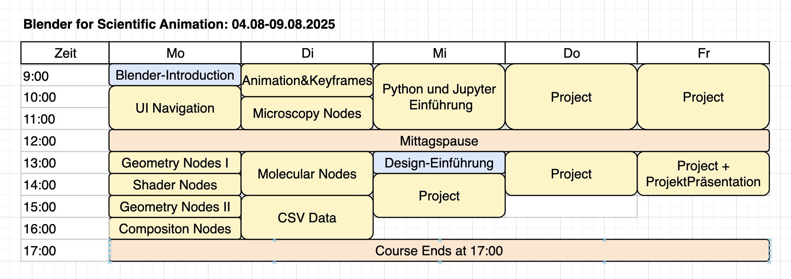

# preliminary course schedule

https://app.diagrams.net/?src=about#G1aWpBXfEwbXRKJSb8ySCZg8-xc_1qO3tn#%7B%22pageId%22%3A%22e7010aeb-78dc-98c9-4316-6516fd28bfe3%22%7D

# Day1:

- **Input / Lecture** : Intro Blender
  - Show reel
  - Show what we will do in the course
  - target audince
  - jobs (phywe, veritasium, Spiegel, ...)
  - Similar software
  - node trees 
  - All areas of blender
  
- **HandsOn**: d1a_interface.md
  - Shortcuts, object types
  

- Follow Along: 

- Intro Geometry Nodes
- Hands

UI
- GeoNodes I
- ShaderNodes I
- GeoNodes II
- Compositor Nodes

# Day2:

- Animation and Keyframes
- Microscopy Nodes
- Molecular Nodes
- CSV Data

# Day3:

- Python & Jupyter
- Design 
- Project Work

# Day 4:

- Project Work

# Day 5 

-