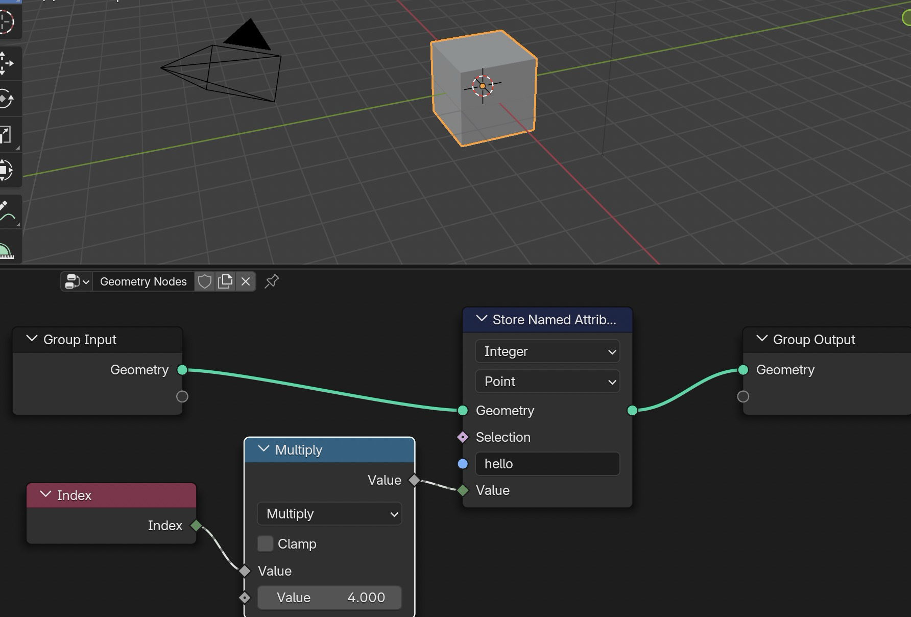

# Blender Geometry Nodes Fundamentals

**Author:** Jan-Hendrik Müller  
**Last updated:** 25.6.2025  
**Blender Version:** 4.5

## 🧱 Block 1 – Geometry Nodes Basics

### Questions
- What is procedural modeling?
- How do I add a Geometry Nodes modifier?
- What are inputs, outputs, and node links?

### Objectives
- Add a Geometry Nodes modifier to a mesh.
- Create basic shapes like cube, sphere, grid.
- Connect nodes and view the result in the viewport.

🧑‍💻 Task: create this spreadsheet:

✅ Solution

